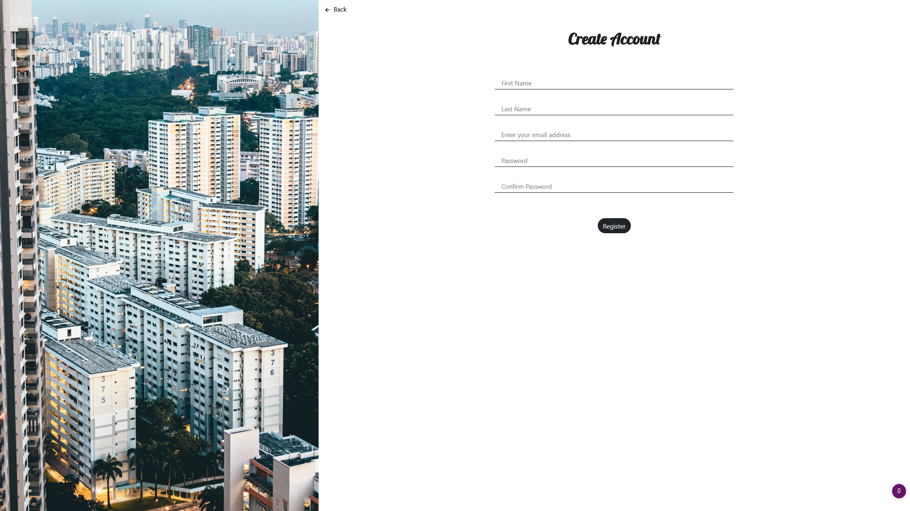
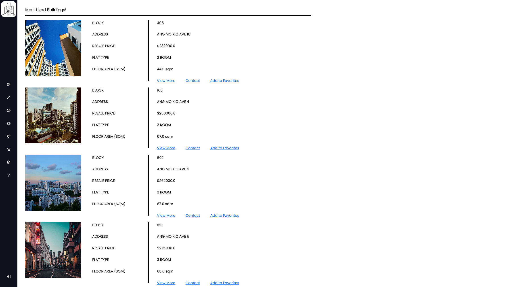

# Software Engineering Project - FindMyHDB

### ⚙️ Technologies Used:

---

## Introduction

FindMyHDB is a web application developed using the Flask web framework. The application is recommended to be used on a PC, on browsers such as Firefox and Google Chrome for the best experience.

The application aims to facilitate the recommendation of the resale HDB flats and providing useful information to users based on the user’s specifications. Our goal is to design an intuitive system allowing customers searching for HDBs ease of access to the information they require, using the recommendation algorithm we have implemented. With our application, users may locate and search for HDBs based on their preferences. In addition, users have the option to contact the owners of the HDB listed on the application to discuss about their interest in the flat.

---

## Product Functions
This section provides a list of functions that is available within the application.

> 1. **HDB Recommendation:** Users can enter their ideal preferences for their perfect HDB. The recommendation algorithm will use these inputs provided by the user to match the users to a list of recommended HDB flats.    
> The HDB recommendation takes into consideration these user preferences:  
> &nbsp; &nbsp; **i.** The type of HDB flat (1-Room, 2-Room, etc.)  
> &nbsp; &nbsp; **ii.** User’s budget  
> &nbsp; &nbsp; **iii.** Nearby amenities  
> &nbsp; &nbsp; **iv.** Distance away from amenity  
> &nbsp; &nbsp;  **v.** Preferred location  

> 2. **Display Amenities on Map:** After the list of recommendations are displayed to the user, users can choose to view more information about their recommendation. This function will display a static map which identifies all the nearby amenities specified by the user.

> 3. **Favorites:** Users are allowed to favorite different HDBs listed on the application. These favorited HDBs are stored in our database, respective to each individual’s account.

> 4. **Top picks:** Users will be greeted with a Top Picks page once they log into our system. This page shows the most favorited HDBs within our system.

> 5. **Compare:** Upon displaying the recommendations, the application provides an intuitive compare function which summarizes the important information from the results into a compact form for ease of readability and convenience.

---

## References and API
This section provides a list of APIs and references used in the project.
> 1. [Google Maps API](https://developers.google.com/maps/documentation/embed/get-started)
> 2. [Google Places API](https://developers.google.com/maps/documentation/places/web-service/overview)
> 3. [Google Geocoding API](https://developers.google.com/maps/documentation/geocoding/overview)
> 4. [Google Distance Matrix API](https://developers.google.com/maps/documentation/distance-matrix/overview)
> 5. [HDB Resale Flats Data](https://data.gov.sg/dataset/resale-flat-prices)
> 6. [Flask](https://flask.palletsprojects.com/en/2.0.x/)

---

## P.S. Application is not currently hosted on a server.
Included below are some images for illustration purposes.

---

### Credits
[Chen HongPo](https://github.com/pokerty)  
[Ma JiaXin](https://github.com/Jiaxin0009)  
[Reeves Chiu](https://github.com/Nydream)  
[Jovian Lim](https://github.com/Kiriketsuki)  
